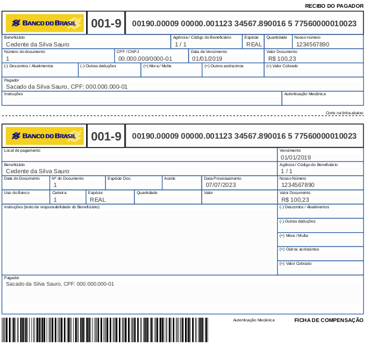

# Bopepo Cobrança

Este projeto é um fork feito por Braully Rocha da Silva,
do projeto JRimum Bopepo: http://www.jrimum.org
com os seguintes objetivos:


# Objetivos desse fork

- Unificado das bibliotecas do projeto JRimum (concluído)
- Atualizar dependências: Java 11 e itextpdf5 (concluído)
- Refatorar pacotes reduzindo a quantidade em unidades maiores e coesas (concluído)
- Biblioteca pra gerar boletos, arquivos de remessa e retorno  (concluído)
- Façade para facilitar o uso da biblioteca (concluído)
- Disponiblizar uma versão estável no repositorio maven central (concluído)

## Suporte:

Boleto Registrado:
- Banco do Brasil
- Bradesco
- Caixa
- Itau
- Santander
- Sicredi

Remessa de boleto Layout CNAB 240:

- Febraban Cnab 240 - versão 5.0 (https://portal.febraban.org.br/pagina/3053/33/pt-br/layout-240)
- Banco do Brasil Cnab  240 - 2019 (https://www.bb.com.br/docs/pub/emp/empl/dwn/CNAB240SegPQRSTY.pdf)
- Bradesco Cnab 400 - versão 15 por @EdsonIsaac (https://banco.bradesco/assets/pessoajuridica/pdf/4008-524-0121-layout-cobranca-versao-portugues.pdf)
- Caixa Cnag 240 - por @EdsonIsaac http://www.caixa.gov.br/Downloads/cobranca-caixa/Manual_de_Leiaute_de_Arquivo_Eletronico_CNAB_240.pdf

- Itaú - Febraban Cnab 240 (necessário fazer personalizações especificas do banco)
- Santander - Febraban Cnab 240 (necessário fazer personalizações especificas do banco)
- Sicredi - Febraban Cnab 240 (necessário fazer personalizações especificas do banco)

Retorno de boletos CNAB 240:

- Febraban Cnab 240 - versão 5.0 (https://portal.febraban.org.br/pagina/3053/33/pt-br/layout-240)
- Banco do Brasil Cnab  240 - 2019 (https://www.bb.com.br/docs/pub/emp/empl/dwn/CNAB240SegPQRSTY.pdf)
- Bradesco Cnab 400 - versão 15 by @EdsonIsaac (https://banco.bradesco/assets/pessoajuridica/pdf/4008-524-0121-layout-cobranca-versao-portugues.pdf)
- Caixa Cnag 240 - by @EdsonIsaac http://www.caixa.gov.br/Downloads/cobranca-caixa/Manual_de_Leiaute_de_Arquivo_Eletronico_CNAB_240.pdf
- Itau - Febraban Cnab 240 (necessário fazer personalizações especificas do banco)
- Santander - Febraban Cnab 240 (necessário fazer personalizações especificas do banco)
- Sicredi - Febraban Cnab 240 (necessário fazer personalizações especificas do banco)


## Instalação e compilação

Baixa e compilar a biblioteca:
```
$ git clone https://github.com/braully/bopepo.git

$ cd bopepo

$ ./sh/compile.sh 
```

## Artefato do Maven Central

O artefato do maven central pode ser encontrado em:
```xml
<dependency>
        <groupId>io.github.braully</groupId>
        <artifactId>bpp-cobranca</artifactId>
        <version>1.0.1</version>
</dependency>
```

# Exemplos

Vejamos a seguir alguns exemplos de uso da biblioteca.

## Boleto simples

Como criar um boleto simples:

```java
import com.github.braully.boleto.BoletoCobranca;
import org.jrimum.bopepo.view.BoletoViewer;

public class ExemploBoletoSimples {

    public static void main(String... args) {
        BoletoCobranca boleto = new BoletoCobranca();
        boleto.sacado("Sacado da Silva Sauro").sacadoCpf("1");
        boleto.banco("1").agencia("1").conta("1");
        boleto.cedente("Cedente da Silva Sauro").cedenteCnpj("1");
        boleto.carteira("1");
        boleto.numeroDocumento("1")
                .nossoNumero("1234567890")
                .valor(100.23).dataVencimento("01/01/2019");

        boleto.gerarLinhaDigitavel();
        BoletoViewer create = BoletoViewer.create(boleto);
        create.getPdfAsFile("./target/teste.pdf");
    }
}
```

Um boleto de teste seria criado dentro da pasta target com o nome teste.pdf. Esse boleto contem dados fictícios e não pode ser pago.


  


### Remessa de boleto CNAB 240

Um arquivo de remessa de boletos de cobrança contem um ou mais lotes de boletos. Cada lote pode conter um ou mais boletos.

Nesse exemplo simples iremos criar um arquivo de remessa com apenas um lote de boletos e dois boletos fictício.

```java
import com.github.braully.boleto.LayoutsSuportados;
import com.github.braully.boleto.RemessaArquivo;
import java.util.Date;
import org.jrimum.utilix.DateFormat;


public class ExemploRemessaSimles {
        RemessaArquivo remessa = new RemessaArquivo(LayoutsSuportados.LAYOUT_BB_CNAB240_COBRANCA_REMESSA);
        //Cabeçalho do arquivo de remessa: obrigatório
        remessa.addNovoCabecalho()
                .sequencialArquivo(1)
                .dataGeracao(new Date()).setVal("horaGeracao", new Date())
                .banco("0", "Banco").cedente("ACME S.A LTDA.", "1")
                .convenio("1", "1", "1", "1")
                .carteira("00");
        //Cabeçalho do lote: obrigatório
        remessa.addNovoCabecalhoLote()
                .operacao("R")//Operação de remessa
                .servico(1)//Cobrança
                .forma(1)//Crédito em Conta Corrente
                .banco("0", "Banco")
                .cedente("ACME S.A LTDA.", "1")
                .convenio("1", "1", "1", "1")
                .carteira("00");;

        int contadorRegistroLote = 1;
        //Detalhes do boleto #1  
        // Boleto emitido pela empresa ACME S.A. ltada
        // Para o cliente: Fulano de Tal cpf: 000.000.000-00
        // Valor R$ 0,01 com vencimento na data de 13/12/2024
        remessa.addNovoDetalheSegmentoP()
                //Dados da cobrança
                .valor(1)
                .valorDesconto(0).valorAcrescimo(0)//opcionais
                .dataGeracao(new Date())
                //.dataVencimento(new Date())
                .dataVencimento(DateFormat.DDMMYYYY_B.parse("13/12/2024"))
                .numeroDocumento(1).nossoNumero(1)
                //Dados da Empresa ACM S.A. LTDA
                .banco("0", "Banco")
                .cedente("ACME S.A LTDA.", "1")
                .convenio("1", "1", "1", "1")
                //.sequencialRegistro(1)
                .sequencialRegistro(contadorRegistroLote++)
                .carteira("00");

        remessa.addNovoDetalheSegmentoQ()
                //Dados do cliente
                .sacado("Fulano de Tal", "00000000000")
                .banco("0", "Banco")
                .cedente("ACME S.A LTDA.", "1")
                .convenio("1", "1", "1", "1")
                //.sequencialRegistro(2)
                .sequencialRegistro(contadorRegistroLote++)
                .carteira("00");

        //Detalhes do boleto #2 Boleto emitido pela empresa ACME S.A. ltada
        // Para o cliente: Ciclano de Tal cpf: 11111111111
        // Valor R$ 2,50 com vencimento na data de hoje
        remessa.addNovoDetalheSegmentoP()
                .valor(2.50)
                .valorDesconto(0).valorAcrescimo(0)//opcionais
                .dataGeracao(new Date())
                .dataVencimento(new Date())
                .numeroDocumento(2).nossoNumero(2)
                .banco("0", "Banco")
                .cedente("ACME S.A LTDA.", "1")
                .convenio("1", "1", "1", "1")
                //.sequencialRegistro(3)
                .sequencialRegistro(contadorRegistroLote++)
                .carteira("00");
        //Detalhes do boleto #2
        remessa.addNovoDetalheSegmentoQ()
                .sacado("Ciclano de Tal", "11111111111")
                .banco("0", "Banco")
                .cedente("ACME S.A LTDA.", "1")
                .convenio("1", "1", "1", "1")
                //.sequencialRegistro(4)
                .sequencialRegistro(contadorRegistroLote++)
                .carteira("00");

        //Rodapé do lote: obrigatório
        remessa.addNovoRodapeLote()
                .quantidadeRegistros(2)
                .valorTotalRegistros(1)
                .banco("0", "Banco")
                .cedente("ACME S.A LTDA.", "1")
                .convenio("1", "1", "1", "1")
                .carteira("00");

        //Rodapé do arquivo de remessa: obrigatório
        remessa.addNovoRodape()
                .quantidadeRegistros(1)
                .valorTotalRegistros(1)
                .setVal("codigoRetorno", "1")
                .banco("0", "Banco").cedente("ACME S.A LTDA.", "1")
                .convenio("1", "1", "1", "1")
                .carteira("00");

        String remessaStr = remessa.render();
        System.out.println(remessaStr);
    }
}
```

Abaixo a saída esperada para essa remessa criada.


```txt
00000000         200000000000001000000001001400000  00000100000000000011ACME S.A LTDA.                BANCO                                   10707202302055600000110300000                                                                     
00000011R01  060 2000000000000001000000001001400000  00000100000000000011ACME S.A LTDA.                                                                                                0000000000000000                                         
0000001300001P 01000001000000000000111                   111220000000000000011312202400000000000000100000002N070720233000000000000000000000000000000000000000000000000000000000000000000000000000000000000000000000000000000300000009           
0000001300002Q 011000000000000000FULANO DE TAL                                                                                  00000000                 0000000000000000                                        00000000000000000000000        
0000001300003P 01000001000000000000112                   11122000000000000002070720230000000000002.500000002N070720233000000000000000000000000000000000000000000000000000000000000000000000000000000000000000000000000000000300000009           
0000001300004Q 011000011111111111CICLANO DE TAL                                                                                 00000000                 0000000000000000                                        00000000000000000000000        
00000015         000002000000000000000001000000000000000000000000                                                                                                                                                                               
00099999         000001000001000000                                                                                                                                                                                                             
                                                   
```

### Ler um arquivo de retorno de boleto CNAB 240:

O código abaixo mostra como ler um arquivo de retorno de boleto CNAB 240. Normalmente compatível com todos os bancos, porém existem personalizações possíveis para cada banco. Favor conferir a documentação do banco para maiores detalhes. A versão do layout também podem apresentar diferenças, porém o código abaixo é compatível com a versão 5.0 do layout.

```java
import com.github.braully.boleto.LayoutsSuportados;
import com.github.braully.boleto.RetornoArquivo;
import com.github.braully.boleto.TituloArquivo;
import java.io.BufferedReader;
import java.io.FileNotFoundException;
import java.io.FileReader;
import java.io.IOException;
import java.util.ArrayList;
import java.util.List;

public class ExemploProcessamentoArquivoRetorno {

    public static void main(String... args) throws FileNotFoundException, IOException {

        BufferedReader leitorArquivo = new 
        //Arquivo de retorno fornecido pelo banco
        BufferedReader(new FileReader("RETORNO001.txt"));

        List<String> linhasLidas = new ArrayList<>();
        String linha = null;
        while (null != (linha = leitorArquivo.readLine())) {
            linhasLidas.add(linha);
        }

        // Layout de arquivo de retorno
        RetornoArquivo retorno = new RetornoArquivo(LayoutsSuportados.LAYOUT_FEBRABAN_CNAB240);
        // Parse do arquivo lido no layout LAYOUT_FEBRABAN_CNAB240
        retorno.parse(linhasLidas);

        System.out.println("Detalhes as Titulos: ");

        List<TituloArquivo> titulos = retorno.detalhesAsTitulos();
        //Titulos encontrados no arquivo de retorno
        // E principais dados disponiveis
        for (TituloArquivo titulo : titulos) {
            String segmento = titulo.segmento();
            String numeroDocumento = titulo.numeroDocumento();
            String nossoNumero = titulo.nossoNumero();
            String valorPagamento = titulo.valorPagamento();
            String valorLiquido = titulo.valorLiquido();
            String dataOcorrencia = titulo.dataOcorrencia();
            String movimentoCodigo = titulo.movimentoCodigo();
            String rejeicoes = titulo.rejeicoes();
            String valorTarifaCustas = titulo.valorTarifaCustas();

            // Print dos dados
            System.out.println("Campos: {segmento=" + segmento + " numeroDocumento=" + numeroDocumento);
            System.out.println("\tnossoNumero=" + nossoNumero + " valorPagamento=" + valorPagamento);
            System.out.println("\tvalorLiquido=" + valorLiquido + " dataOcorrencia=" + dataOcorrencia);
            System.out.println("\tmovimentoCodigo=" + movimentoCodigo + " rejeicoes=" + rejeicoes);
            System.out.println("\tvalorTarifaCustas=" + valorTarifaCustas + " rejeicoes=" + valorTarifaCustas + "}");
        }
    }
}
```


### Criar um novo layout de remessa ou de retorno

```java
import com.github.braully.boleto.TagLayout;
import static com.github.braully.boleto.TagLayout.TagCreator.*;
import java.text.SimpleDateFormat;

public class ExemploLayoutSimples {

    /*
     * Ver exemplo mais detalhado em:
     * com.github.braully.boleto.LayoutsSuportados._LAYOUT_FEBRABAN_CNAB240
     */
    public static void main(String... args) {
        TagLayout arquivo = tag("arquivo");
        arquivo.with(
                tag("cabecalho").with(
                        //a linha de cabeçalho será ignorada
                        tag("branco").length(240)
                ),
                tag("detalhe").with(
                        tag("codigoBanco").length(3),
                        //Val é usado para setar um campo literal fixo: espaçoes em branco, codigos, literais e etc
                        tag("branco").val("  "),
                        tag("codigoMoeda").val("09"),
                        //As tags com id são importantes pra determinar o tipo da linha no layout de retorno
                        tag("codigoRegistro").length(1).id(true),
                        tag("segmento").id(true).value("D"),
                        //Alguns campos podemo precisar de formatação ou parser personalizado, exemplo data
                        tag("dataVencimento").length(8).format(new SimpleDateFormat("ddMMyyyy"))
                ),
                tag("rodape").with(
                        //a linha de rodape será ignorada
                        tag("branco").length(240)
                )
        );

        //
        System.out.println(arquivo);
    }
}
```


# Principais alterações desse fork

O Projeto Original Jrimum bobepo possui três branches de desenvolvimento e alguns projetos relacionados.
Acredito que é a biblioteca java livre mais completa disponivel, porém a muito os desenvolvedores originais não atualizam o projeto.

Com a grande demanda surgida com a obrigatoriedade de boletos registrados e alguns projetos legados. Decidi fazer um fork e atualizar o projeto. Primeiramente foi unificado as branches e feito um merge no master, tornando novamente a linha principal de desenvolvimento. Após isso unificar os projetos e os pacotes envolvidos tentando dar mais clareza e organização ao projeto.

Ainda é um trabalho em andamento, mas já é possível utilizar o projeto para gerar boletos registrados, ler arquivos de retorno e remessas de boleto. E com o tempo irei atualizar a documentação e os exemplos.
Foi adicionado uma versão no maven central, pra facilitar a utilização do projeto.

Qualquer contribuição é bem vinda, favor fazer um fork, alterar, criar o teste e enviar um pull request.


Merge das branches e projetos:

- 'helio'
- 'litio' 
- 'bopepo' 
- 'domkee' 
- 'utilix' 
- 'vallia' 
- 'texgit'
- 'texgit-febraban'

Concentrar todas as classes nos pacotes:

- com.github.braully.boleto
- org.jrimum
- org.jrimum.bopepo
- org.jrimum.bopepo.campolivre
- org.jrimum.bopepo.parametro
- org.jrimum.bopepo.pdf
- org.jrimum.bopepo.view
- org.jrimum.bopepo.banco
- org.jrimum.domkee.pessoa
- org.jrimum.domkee.banco
- org.jrimum.utilix
- org.jrimum.valia